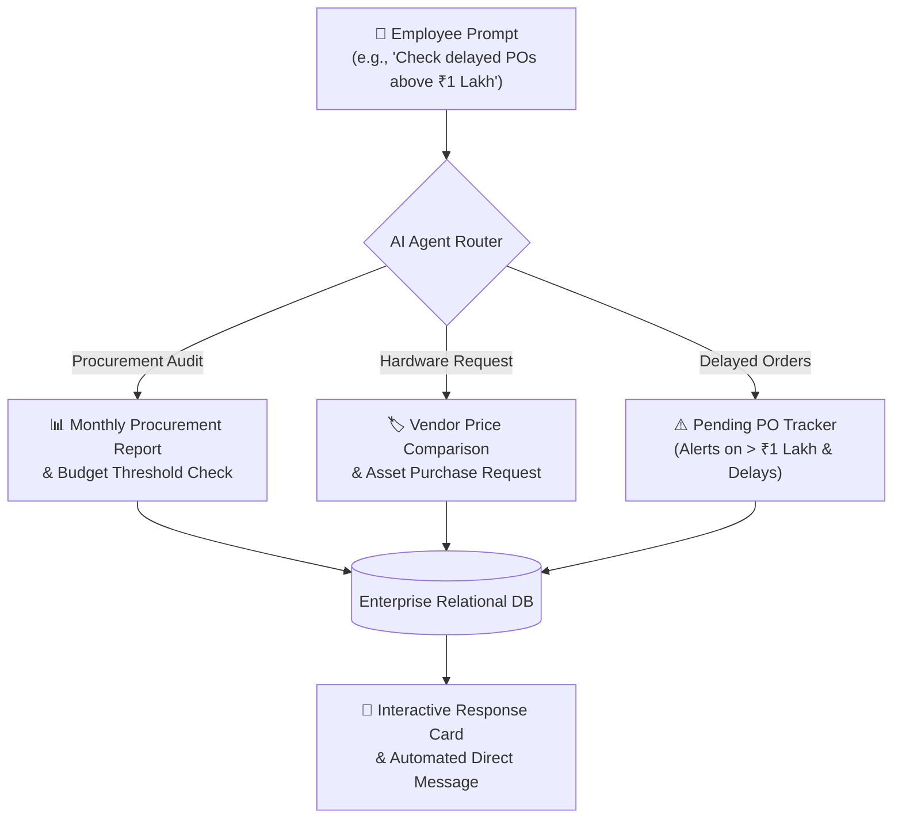

# ChatGPT Conversation Documentation: AI-Integrated ERP Stack

**Source Conversation**: [Binukumar D - AI-Integrated ERP Stack (ChatGPT Share)](https://chatgpt.com/share/6a83f998-2f24-83e8-8bfe-6e19612ae540)  
**Document Version**: 1.0.0  
**Last Updated**: August 2026  

---

## 1. Executive Summary

This documentation synthesizes the architectural decisions, agent skill frameworks, and operational workflows discussed in the shared ChatGPT conversation **"AI-Integrated ERP Stack"**. 

The conversation focuses on transforming a standard Enterprise Resource Planning (ERP) platform into an **AI-native, prompt-driven system** where autonomous agents handle procurement, asset tracking, vendor evaluations, budget approvals, and staff attendance queries via natural language prompts.

---

## 2. Core Concepts & Agent Skill Definitions

### 2.1 What is an AI Agent Skill?
> *"A skill is a saved, reusable set of instructions, function tool declarations, and context rules that help an AI assistant handle specialized enterprise tasks consistently."*

In the context of the HRMs-ERP system:
- **System Skills**: Pre-configured function calling tools (e.g. `createTicket`, `applyLeave`, `sendMessageToUserOrChannel`, `queryTeamAttendance`).
- **Domain Skills**: Specialized prompts for Procurement Analysis, Budget Tracking, Asset Tracking, and Vendor Price Comparison.

---

## 3. Key Workflows & Conversation Specifications

The shared conversation highlights 3 primary procurement & asset management workflows:



### 3.1 Monthly Procurement & Budget Audit
* **Prompt Intent**: *"Prepare the monthly procurement report, identify purchases above budget, compare vendor prices, and create draft purchase requests for items that need reordering."*
* **Execution Logic**:
  1. Scans monthly purchase logs from the database.
  2. Flags purchases exceeding department budget thresholds.
  3. Compares vendor pricing models for recurring inventory items.
  4. Generates draft purchase requisitions for manager approval.

### 3.2 Asset & Equipment Purchase Request Workflow
* **Prompt Intent**: *"I found 3 approved projector models. The estimated cost is ₹X. Would you like me to create the purchase request?"*
* **Execution Logic**:
  1. Filters approved hardware models from IT/Media equipment catalogs.
  2. Computes total estimated cost including taxes and delivery.
  3. Prompts the user with an interactive confirmation card before submitting the formal purchase request.

### 3.3 High-Value Pending Purchase Order Alerting
* **Prompt Intent**: *"Show me all pending purchase orders above ₹1 lakh and identify which ones are delayed."*
* **Execution Logic**:
  1. Queries pending purchase orders filtered by `amount > 100,000`.
  2. Compares expected delivery dates against the current date.
  3. Highlights delayed orders and offers to notify vendor account managers.

---

## 4. Integration with HRMs-ERP & HRMs-AI Architecture

To integrate these conversation insights into our current **HRMs-ERP (Keka Clone)** and **HRMs-AI Engine**:

| Conversation Capability | HRMs-AI Tool Mapped | Backend Implementation | UI Presentation |
| :--- | :--- | :--- | :--- |
| **High-Value PO Tracker** | `queryPendingPurchaseOrders` | Express endpoint `/api/procurement/pending` | Helpdesk & Finance Dashboard Cards |
| **Asset Purchase Requisition** | `createPurchaseRequest` | Staged in `agent_pending_actions` (HIGH Risk HITL) | Interactive Confirmation Card |
| **Vendor Price Comparison** | `compareVendorPricing` | RAG Search over Vendor SOPs & Catalogs | Side-by-side Pricing Table |
| **Direct Message Dispatching** | `sendMessageToUserOrChannel` | Dispatches generated PO notifications to target chats | Teams Chat Screen & Dashboard Floating Chatbot |

---

## 5. Prompt Templates & Skill System Instructions

### 5.1 System Instruction Prompt Template
```markdown
You are the Procurement & Asset Intelligence Agent for HRMs-ERP.
When a user asks to reorder assets or check budget thresholds:
1. Verify department budget limits before drafting requests.
2. For purchase requisitions exceeding ₹1 Lakh, mark the action as HIGH risk requiring Human-In-The-Loop confirmation.
3. Compare at least 2 approved vendors when proposing hardware reorders.
4. Format prices in Indian Rupees (₹) with comma formatting.
```

### 5.2 Example Interaction Flow
```
User: "Show me all pending purchase orders above ₹1 lakh and tell me which ones are delayed."
AI: "I found 2 pending purchase orders above ₹1 Lakh:
     1. PO #4092 - AV Media Projectors (₹1,85,000) - Status: Delayed by 4 days (Vendor: Sony Direct)
     2. PO #4105 - Workstation Displays (₹1,20,000) - Status: On Track (Delivery: Aug 22)
     Would you like me to send a follow-up message to the Sony account representative?"
```

---

## 6. Implementation Status & Next Steps

- [x] **Conversation Review & Analysis**: Extracted procurement, skill definition, and PO tracking specifications.
- [x] **Documentation Created**: Generated `CHATGPT.md` and `docs/CHATGPT.md`.
- [ ] **Procurement Function Declarations**: Add `createPurchaseRequest` and `queryPendingPurchaseOrders` to `toolRegistry.js`.
- [ ] **Finance & Procurement Tab**: Connect procurement cards to `ChatService` and `VoiceHelper` TTS.
