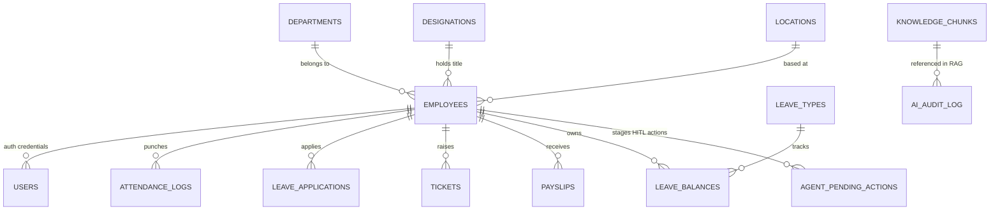

# Asian Christian Academy of India — Master Database Schema Blueprint

This document contains the complete database schema architecture for both the **HRMS-ERP Platform** (relational tables) and the **HRMS-AI Engine** (vector search & HITL staging tables).

---

## 1. Master Entity-Relationship (ER) Diagram

---

## 2. Table Modules & Specifications

### A. Core Organization & Employee Management

#### 1. `employees`
Central employee master table storing demographic, contact, and employment status.
* `id` (INT, PK, Auto Increment) — Unique employee ID.
* `employee_code` (VARCHAR(20), UNIQUE) — Employee Code (e.g. `ACA-001`).
* `first_name` (VARCHAR(50)) — First Name.
* `last_name` (VARCHAR(50)) — Last Name.
* `dob` (DATE) — Date of Birth.
* `gender` (ENUM: `'Male'`, `'Female'`, `'Other'`).
* `personal_email` (VARCHAR(100)) — Email address.
* `phone` (VARCHAR(20)) — Phone number.
* `department_id` (INT, FK `departments.id`).
* `designation_id` (INT, FK `designations.id`).
* `location_id` (INT, FK `locations.id`).
* `reporting_manager_id` (INT, FK `employees.id`).
* `date_of_joining` (DATE).
* `employment_type` (ENUM: `'Full-Time'`, `'Part-Time'`, `'Contract'`, `'Intern'`).
* `status` (ENUM: `'Active'`, `'Suspended'`, `'Terminated'`, `'On Leave'`).

#### 2. `departments`
Organizational departments (Media, Maintenance, Finance, CPD, HR, Inventory, HOB, IT, etc.).
* `id` (INT, PK).
* `name` (VARCHAR(100)) — Department name.
* `parent_department_id` (INT, FK `departments.id`) — Parent department for hierarchical org charts.

#### 3. `designations`
Job titles and grades across departments.
* `id` (INT, PK).
* `title` (VARCHAR(100)) — Designation title.
* `grade` (VARCHAR(20)) — Pay grade / seniority level.

#### 4. `locations`
Campus locations and branch offices.
* `id` (INT, PK).
* `name` (VARCHAR(100)) — Location name (e.g. `ACA Main Campus`).
* `address` (TEXT) — Full address.
* `timezone` (VARCHAR(50)) — Timezone (e.g. `Asia/Kolkata`).

---

### B. Authentication & Access Control

#### 5. `users`
System login accounts and credentials.
* `id` (INT, PK).
* `employee_id` (INT, FK `employees.id`).
* `email` (VARCHAR(100), UNIQUE) — Login email.
* `password_hash` (VARCHAR(255)) — Bcrypt password hash.
* `role_id` (INT, FK `roles.id`) — User role (`Employee`, `Manager`, `Admin`).
* `is_active` (TINYINT(1)) — Active account status flag.

#### 6. `roles` & `permissions`
Role-Based Access Control (RBAC) definition.
* `roles.id`, `roles.name` (VARCHAR(50), UNIQUE).
* `permissions.id`, `permissions.role_id`, `permissions.module`, `permissions.action`.

---

### C. Attendance & Shift Management

#### 7. `attendance_logs`
Clock-in / Clock-out punches from Web, Mobile, or Biometric devices.
* `id` (INT, PK).
* `employee_id` (INT, FK `employees.id`).
* `date` (DATE) — Punch date.
* `check_in` (TIME) — Clock-in timestamp.
* `check_out` (TIME) — Clock-out timestamp.
* `source` (VARCHAR(50)) — Punch source (`Web`, `Mobile`, `Biometric`).
* `latitude`, `longitude` (DECIMAL) — Geo-location coordinates.

#### 8. `regularization_requests`
Missed punch regularization applications.
* `id` (INT, PK).
* `employee_id` (INT, FK `employees.id`).
* `date` (DATE) — Missed punch date.
* `reason` (TEXT) — Justification text (can be generated via AI).
* `status` (ENUM: `'Pending'`, `'Approved'`, `'Rejected'`).

---

### D. Leaves & Holidays

#### 9. `leave_balances`
Per-employee annual leave quotas.
* `id` (INT, PK).
* `employee_id` (INT, FK `employees.id`).
* `leave_type_id` (INT, FK `leave_types.id`).
* `year` (INT) — Calendar year.
* `opening` (DECIMAL(5,2)) — Opening balance.
* `accrued` (DECIMAL(5,2)) — Accrued leaves.
* `used` (DECIMAL(5,2)) — Used leaves.
* `balance` (DECIMAL(5,2)) — Net available balance (`opening + accrued - used`).

#### 10. `leave_applications`
Submitted leave requests.
* `id` (INT, PK).
* `employee_id` (INT, FK `employees.id`).
* `leave_type_id` (INT, FK `leave_types.id`).
* `from_date` (DATE), `to_date` (DATE), `days` (DECIMAL(4,1)).
* `reason` (TEXT).
* `status` (ENUM: `'Pending'`, `'Approved'`, `'Rejected'`).

---

### E. Helpdesk & Operations

#### 11. `tickets`
Multi-department Helpdesk tickets (Media, Maintenance, IT, HR, Finance, etc.).
* `id` (INT, PK).
* `employee_id` (INT, FK `employees.id`) — Ticket requester.
* `category` (VARCHAR(50)) — Department category (`Media`, `Maintenance`, `IT`, `Finance`, `HR`).
* `subject` (VARCHAR(150)) — Issue subject line.
* `description` (TEXT) — Detailed description.
* `priority` (ENUM: `'Low'`, `'Medium'`, `'High'`, `'Critical'`).
* `assigned_to` (INT, FK `employees.id`) — Assigned agent.
* `status` (ENUM: `'Open'`, `'In Progress'`, `'On Hold'`, `'Closed'`).

---

### F. HRMS-AI Engine & Vector Database (PostgreSQL 16 + `pgvector`)

#### 12. `knowledge_chunks`
Vector document store for Retrieval-Augmented Generation (RAG).
* `id` (VARCHAR(64), PK) — Unique chunk ID (e.g. `aca_policy_leave_2026`).
* `category` (VARCHAR(64)) — Department tag (`HR`, `IT`, `CPD`, `HOB`, `Finance`).
* `title` (VARCHAR(255)) — Document section title.
* `content` (TEXT) — Raw policy text chunk.
* `embedding` (`vector(1536)`) — **1536-dimensional math vector embedding**.
* **Index**: `HNSW` (Hierarchical Navigable Small World) index for sub-millisecond vector cosine distance search.

#### 13. `agent_pending_actions`
Human-In-The-Loop (HITL) staged action confirmation table.
* `action_id` (VARCHAR(64), PK) — Unique staged action ID (e.g. `action_1787134061204`).
* `user_id` (VARCHAR(64)) — Employee requesting the action.
* `action_type` (VARCHAR(64)) — Action type (`applyLeave`, `createTicket`, `sendMessage`).
* `risk_level` (VARCHAR(16)) — Risk assessment (`LOW`, `MEDIUM`, `HIGH`).
* `payload` (JSONB) — Action parameters.
* `status` (VARCHAR(32)) — Staging status (`PENDING`, `APPROVED`, `DECLINED`).

#### 14. `ai_audit_log`
Complete prompt, response, and tool invocation history.
* `id` (SERIAL, PK).
* `user_id` (VARCHAR(64)).
* `prompt` (TEXT) — Raw employee prompt string.
* `response_type` (VARCHAR(64)) — Response type (`POLICY_ANSWER`, `HITL_CONFIRMATION_REQUIRED`, `ACTION_EXECUTED`).
* `response_text` (TEXT) — AI response.
* `created_at` (TIMESTAMP WITH TIME ZONE).
