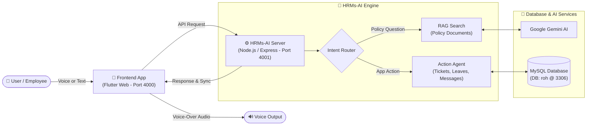

# HRMs-ERP & HRMs-AI Engine — Simplified System Overview

---

## 1. Project Overview

The **HRMs-ERP & HRMs-AI System** is an enterprise HR portal combined with an intelligent AI assistant. It allows employees to manage attendance, submit leave applications, raise service tickets, and chat with team members—either manually through the Web UI or completely hands-free using **voice prompts and automated AI actions**.

---

## 2. Simple System Architecture Diagram



---

## 3. What Has Been Built So Far

### 💻 ERP Application Modules (Port 4000)
- **Home Dashboard**: Quick clock-in/out banner, live department staff presence, announcements, and polls.
- **Me Tab**: Monthly attendance logs, shift details, leave balances, and leave regularization.
- **Helpdesk & Department Portals**: Service ticket logging for IT, HR, Maintenance, Finance, CPD, Inventory, HOB, and Media.
- **My Teams Chat**: Real-time team channels (`#general`, `#maintenance-updates`) and direct messages.

### 🤖 Intelligent HRMs-AI Backend (Port 4001)
- **Policy Chatbot (RAG)**: Answers policy, leave, and SOP questions using grounded document search.
- **Prompt Action Agent**: Performs real app operations via prompts (raising tickets, applying for leave, checking attendance).
- **Direct Message Dispatching**: Generates contextual messages and automatically posts them into team member chats (`Vinodh`, `John Doe`, etc.).
- **Human-In-The-Loop (HITL) Safety**: High-risk actions require interactive UI confirmation before executing.

### 🎙️ Hands-Free Voice & Voice-Over System
- **Speech-To-Text (Mic Button)**: Speak prompts directly into the app without typing.
- **Automatic Voice-Over**: Reads AI responses out loud in clean, natural speech.
- **Listen Buttons**: Tap the **Listen** speaker icon on any message card to replay audio.

---

## 4. How the AI Engine Works (In 3 Simple Steps)

```
[ Step 1: Input ]       --> User speaks or types a command into the app.
[ Step 2: AI Processing ] --> HRMs-AI decides whether to answer a question (RAG) 
                            or perform an action (Function Tool).
[ Step 3: Execution ]    --> AI updates the database, dispatches chat messages, 
                            and speaks the result aloud.
```

---

## 5. Future Technology Upgrades (Top 5 Roadmap Items)

1. 📸 **Receipt & Invoice OCR (Vision AI)**: Scan employee expense receipts and medical bills to automatically pre-fill reimbursement tickets.
2. 👥 **Multi-Agent Specialist Swarm**: Dedicated AI agents for Payroll, Attendance Anomalies, and IT Troubleshooting working together.
3. ⚡ **Real-Time Token Streaming**: Stream AI answers letter-by-letter with live typing effects and instant push notifications.
4. 🔍 **Organizational Knowledge Graph**: Graph-based search mapping employee reporting hierarchies and team dependencies.
5. 📱 **Offline On-Device Voice AI**: Fast on-device speech processing using WebAssembly Whisper for zero-latency speech.
