# HRMs-ERP & HRMs-AI Engine — Master Architecture Chart

---

## 1. Master System Architecture Chart

```mermaid
flowchart TD
    %% LAYER 1: FRAMEWORKS & CLIENT
    subgraph L1 ["1. 🛠️ Frameworks & Core UI Engine (Port 4000)"]
        Flutter["Flutter 3.x Framework (Dart)"]
        StateMgmt["Riverpod State Management & GoRouter Navigation"]
        VoiceTech["Web Speech API (Speech-To-Text) + SpeechSynthesis (Voice-Over TTS)"]
        Flutter --> StateMgmt
        Flutter --> VoiceTech
    end

    %% LAYER 2: ERP MODULES
    subgraph L2 ["2. 🏢 ERP Application Modules"]
        DashMod["Home Dashboard\n(Quick Clock-In/Out, Department Staff Presence, Polls)"]
        MeMod["Me Module\n(Attendance Logs, Leave Balances, Shift Timings, Regularization)"]
        HelpMod["Helpdesk & Department Portals\n(IT, HR, Maintenance, Finance, CPD, Inventory, HOB, Media)"]
        ChatMod["My Teams Chat Module\n(#general, #maintenance-updates, Vinodh, John Doe, DMs)"]
    end
    
    L1 --> L2

    %% LAYER 3: API GATEWAY & COMMUNICATION BRIDGES
    subgraph L3 ["3. 🌐 API Gateways & Communication Bridges"]
        ChatSync["Central ChatService Engine\n(ValueNotifier Live Cross-Window Event Bus)"]
        APIGateway["HRMs-AI Service API Gateway\n(Node.js Express @ http://localhost:4001/api/ai)"]
        ChatSync -->|HTTP REST JSON| APIGateway
    end

    L2 --> ChatSync

    %% LAYER 4: AI AGENTS & ASSISTANTS
    subgraph L4 ["4. 🤖 HRMs-AI Agents, Assistants & Intelligence Engine"]
        IntentRouter{"Intent Router"}
        
        RAGAssistant["📚 RAG Grounded Policy Chatbot\n(ragService.js - Document Hybrid Search)"]
        ActionAgent["⚡ Autonomous Action Agent\n(agentService.js - ReAct Function Calling)"]
        
        ToolSet["Function Tools:\n• createTicket\n• assignTicket\n• applyLeave\n• sendMessageToUserOrChannel\n• queryTeamAttendance"]
        HITLCheck{"HITL Risk Classification\n(LOW, MEDIUM, HIGH Risk)"}
        
        IntentRouter -->|Policy Question| RAGAssistant
        IntentRouter -->|App Action Command| ActionAgent
        ActionAgent --> ToolSet
        ToolSet --> HITLCheck
    end

    APIGateway --> IntentRouter

    %% LAYER 5: DATABASE & EXTERNAL AI CLOUD
    subgraph L5 ["5. 💾 Database & AI Cloud Layer"]
        GeminiAPI["Google Gemini Cloud API\n(gemini-3.6-flash Generative & gemini-embedding-001 Embeddings)"]
        MySQLDB[("MySQL Database: roh @ 127.0.0.1:3306\n(knowledge_chunks, tickets, leaves, agent_pending_actions, chat_messages)")]
        
        RAGAssistant <--> GeminiAPI
        ActionAgent <--> GeminiAPI
        HITLCheck <--> MySQLDB
    end

    L4 --> L5

    %% LAYER 6: NEW ADVANCED TECHNOLOGIES ROADMAP
    subgraph L6 ["6. 🚀 New & Advanced Technologies Roadmap (Future Implementations)"]
        VisionAI["📸 Vision AI OCR\n(Expense Receipts, Medical Bills & Document Parsing)"]
        SwarmAI["👥 Multi-Agent Swarm Architecture\n(Specialized Payroll, Attendance & IT Subagents)"]
        SSEStream["⚡ Real-Time SSE Token Streaming\n& WebSockets Push Notifications"]
        GraphRAG["🔍 GraphRAG Knowledge Graphs\n(Neo4j Reporting Hierarchy & Escalation Trees)"]
        VectorDB["💾 Dedicated Vector Database\n(Qdrant / pgvector with HNSW Indexing)"]
        OnDeviceAI["📱 Zero-Latency On-Device Voice AI\n(WebAssembly Whisper Speech Processing)"]
    end

    L5 -.->|Next Upgrade Phase| L6
```

---

## 2. Layer-by-Layer Architectural Breakdown

### 🛠️ Layer 1: Frameworks & Core UI Engine
- **Frontend Stack**: Flutter 3.x for Web & Mobile built with Dart.
- **State Management**: Riverpod providers combined with custom `ValueNotifier` event buses.
- **Voice Engine**: HTML5 Web Speech API (`startSpeechRecognition`) for Speech-to-Text input, paired with Web SpeechSynthesis API (`window.speakText`) for automatic Voice-Over audio responses.

---

### 🏢 Layer 2: ERP Application Modules
- **Home Dashboard**: Quick clock-in/out, live department staff presence modal, announcements, and polls.
- **Me Module**: Attendance logging, work modes (Office, Home, Field), leave regularization, and leave balances (Casual, Sick, Earned).
- **Helpdesk & Department Portals**: Service ticket management across IT, HR, Maintenance, Finance, CPD, Inventory, HOB, and Media.
- **My Teams Chat**: Multi-channel communication (`#general`, `#maintenance-updates`, `#finance-reimbursements`, `Gemini AI Assistant`, DMs).

---

### 🌐 Layer 3: API Gateways & Communication Bridges
- **Frontend Sync Gateway**: `ChatService` routes prompts from floating chatbot widgets, AI drawers, and chat screens, synchronizing target conversations live.
- **Backend API Gateway**: Node.js/Express service at `http://localhost:4001/api/ai` exposing `/chat`, `/agent`, `/confirm`, and `/decline` endpoints.

---

### 🤖 Layer 4: HRMs-AI Agents, Assistants & Intelligence Engine
- **RAG Grounded Policy Chatbot (`ragService.js`)**: Hybrid BM25 FullText + Cosine Similarity search over 3072-dimensional vector embeddings, delivering 100% grounded policy answers without hallucinations.
- **Autonomous Action Agent (`agentService.js` & `toolRegistry.js`)**: Converts natural language prompts into function tool calls (`createTicket`, `assignTicket`, `applyLeave`, `sendMessageToUserOrChannel`, `queryTeamAttendance`).
- **Human-In-The-Loop (HITL) Security**: High-risk actions are staged in `agent_pending_actions` and require explicit user approval cards (`CONFIRM` / `DECLINE`).

---

### 💾 Layer 5: Database & AI Cloud Layer
- **Google Gemini Cloud**: `gemini-3.6-flash` for high-speed generative reasoning and function calling; `gemini-embedding-001` for vector embedding generation.
- **MySQL Database (`roh` @ 127.0.0.1:3306)**: Stores structured tables (`tickets`, `leaves`, `attendance`, `employees`, `chat_messages`) and AI tables (`knowledge_chunks`, `agent_action_log`, `agent_pending_actions`).

---

### 🚀 Layer 6: New & Advanced Technologies Roadmap

| Technology | Purpose & Business Value |
| :--- | :--- |
| 📸 **Vision AI OCR** | Scans uploaded employee expense receipts, travel invoices, and medical bills to automatically extract line items and auto-fill reimbursement tickets. |
| 👥 **Multi-Agent Swarm** | Decouples monolithic AI into specialized subagents (*Payroll Agent*, *Attendance Audit Agent*, *IT Diagnostic Agent*) communicating asynchronously. |
| ⚡ **Real-Time Token Streaming** | Uses Server-Sent Events (SSE) and WebSockets for token-by-token live typing effects and instant push alerts when messages/tickets are dispatched. |
| 🔍 **GraphRAG Knowledge Graphs** | Integrates Neo4j / Memgraph to map employee reporting hierarchies and team dependencies for complex multi-hop escalation queries. |
| 💾 **Dedicated Vector Database** | Migrates vector storage to Qdrant or `pgvector` with HNSW indexing for sub-millisecond similarity search across millions of document chunks. |
| 📱 **On-Device Voice AI** | Runs quantized Whisper models via WebAssembly inside the browser for zero-latency, offline voice recognition without cloud network lag. |
