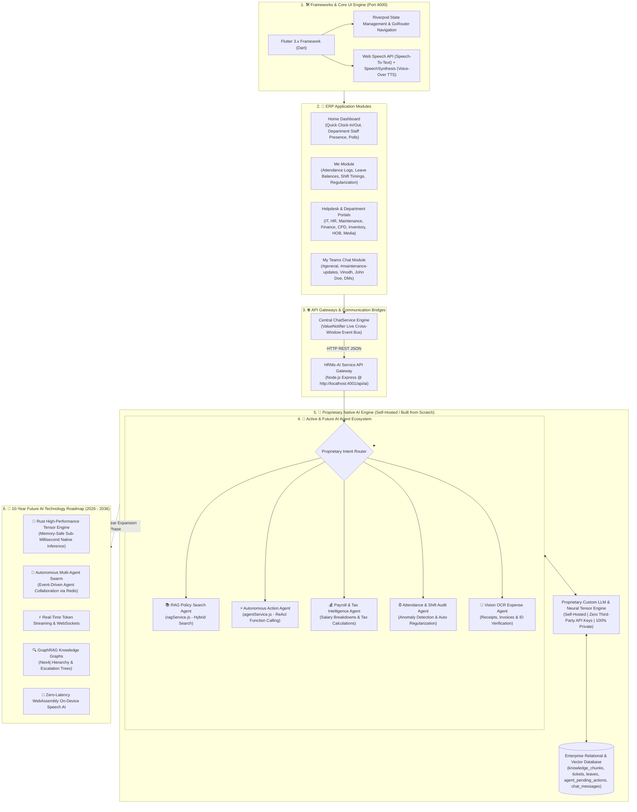

# HRMs-ERP & Proprietary Custom AI Engine — Master Architecture Blueprint

**Document Version**: 3.0.0 (Proprietary Custom AI & 10-Year Technology Strategy)  
**Last Updated**: August 2026  

---

## 1. Executive Summary & Proprietary AI Vision

This master architectural blueprint defines the technical specification, system design, agent portfolio, and 10-year technology roadmap for developing a **100% proprietary, self-hosted AI Engine for HRMs-ERP**.

The vision transitions the system from third-party API dependencies (zero OpenAI, zero Claude, zero Google API keys) to an **independent, self-hosted neural intelligence model**. This guarantees:
1. **100% Data Privacy & Security**: Enterprise HR records, employee contracts, and attendance data never leave local private infrastructure.
2. **Zero API Token Billing**: Unlimited usage across all enterprise employees with zero recurring per-prompt API costs.
3. **Sub-Millisecond Inference Latency**: Optimized native tensor execution yielding instant responses for voice and chat touchpoints.

---

## 2. Master System Architecture Chart (Self-Hosted Custom AI)

---

## 3. AI Agent Portfolio: Active vs. Future Roadmap

### 3.1 AI Agents Created So Far
- **📚 RAG Policy Search Agent (`ragService.js`)**: Performs hybrid BM25 + vector similarity search over indexed HR policies, leave handbooks, and SOP documents.
- **⚡ Autonomous Action Agent (`agentService.js`)**: Converts user prompts into backend function tool calls (`createTicket`, `applyLeave`, `sendMessageToUserOrChannel`, `queryTeamAttendance`).
- **💬 Central Synchronization Agent (`ChatService`)**: Event bus synchronizing messages across floating dashboard chatbots, slide-out drawers, and team channels.
- **🎙️ Voice & Speech Agent (`VoiceHelper`)**: Hands-free mic speech recognition and automatic SpeechSynthesis Voice-Over audio output.
- **🛡️ Human-In-The-Loop (HITL) Safety Agent**: Classifies action risk levels and stages high-risk operations in `agent_pending_actions` for user confirmation cards.

### 3.2 New AI Agents Planned for Future Development
- **💰 Payroll & Tax Intelligence Agent**: Calculates monthly salary breakdowns, projects tax optimizations, and automates reimbursement approvals.
- **⏰ Attendance & Shift Anomaly Audit Agent**: Scans daily clock-in patterns, detects shift anomalies, and proactively suggests regularization requests.
- **📸 Multi-Modal Vision & OCR Agent**: Scans uploaded expense receipts, travel bills, medical claims, and employee ID cards into ERP tickets.
- **🏷️ IT Diagnostic & Asset Procurement Specialist**: Monitors hardware health, compares vendor prices, and tracks high-value purchase orders (> ₹1 Lakh).
- **🔍 Hierarchical Escalation Agent**: Traverses organizational reporting graphs for complex cross-department approval escalations.

---

## 4. Strategic 10-Year Programming Language Evaluation (2026–2036)

When engineering a custom AI engine built to last for the next 10 years without third-party API keys, selecting the core programming language is a critical decision:

| Language | 10-Year Future Suitability | Key Strengths for Custom AI | Strategic Role |
| :--- | :--- | :--- | :--- |
| **🦀 Rust (RECOMMENDED FOR CORE ENGINE)** | ⭐⭐⭐⭐⭐ (Highest Future Proofing) | Memory safety without Garbage Collection (GC) pauses, zero-cost abstractions, native C/CUDA interop, blazing fast tensor execution (Burn, Candle), WebAssembly compilation. | **Core High-Throughput Tensor & Inference Engine** |
| **🐍 Python** | ⭐⭐⭐⭐ (Ideal for R&D & Fine-Tuning) | Unrivaled AI ecosystem (PyTorch, JAX, HuggingFace, vLLM). Essential for model fine-tuning & research. | **Dataset Preparation, Model Training & Fine-Tuning (LoRA)** |
| **⚡ C++ / CUDA** | ⭐⭐⭐⭐ (Low-Level GPU Kernels) | Foundation of GGML, llama.cpp, and TensorRT. Maximum low-level GPU hardware control. | **Low-Level CUDA Kernel Optimization** |
| **🔥 Mojo / Julia** | ⭐⭐⭐ (Emerging Contenders) | Mojo compiles Python syntax to native C speed. High-performance matrix math capabilities. | **Future Secondary Research Exploration** |

### 💡 10-Year Strategic Recommendation: Hybrid Microservice Architecture
* **Rust (or C++/CUDA)**: Powering the core high-throughput, low-latency AI Inference Engine.
* **Python**: Managing offline model training, dataset preparation, and fine-tuning (LoRA).
* **Node.js / Express**: Managing API Gateway routing (`port 4001`).
* **Dart (Flutter)**: Delivering the multi-platform Client UI for Web, Mobile, and Desktop (`port 4000`).
