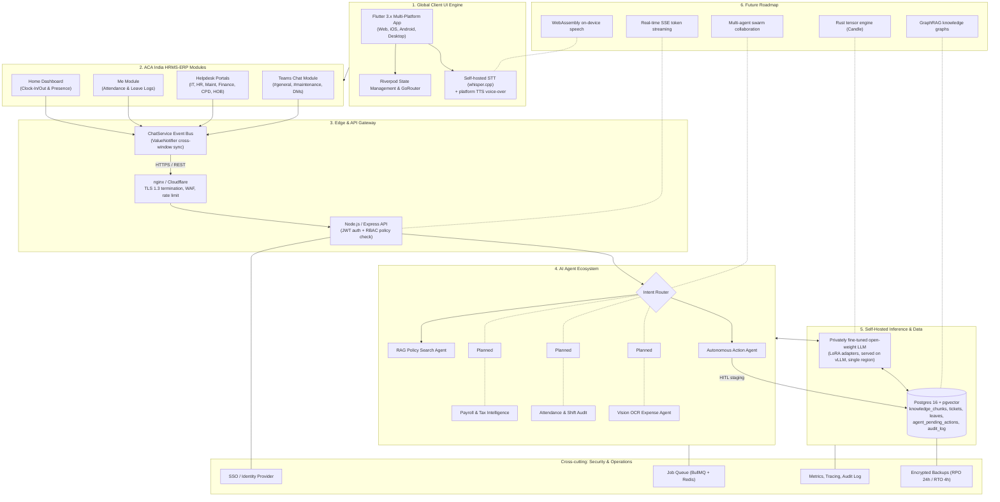

# Asian Christian Academy of India — HRMS-ERP & Self-Hosted AI Engine Architecture Blueprint

**Document Version**: 1.0.0 (Self-Hosted Open-Weight AI Architecture)  
**Document Status**: Enterprise Master Blueprint  
**Last Reviewed**: August 2026  

---

## 1. Executive Summary & Self-Hosted AI Vision

This master architectural blueprint defines the technical specification, system design, agent portfolio, and infrastructure stack for building a **100% self-hosted, privately fine-tuned AI Engine for Asian Christian Academy of India**.

The vision transitions the system from third-party cloud API dependencies (zero OpenAI, zero Claude, zero Gemini API keys) to an **independent, self-hosted open-weight neural model runtime**. This guarantees:
1. **100% Data Privacy & Security**: Enterprise HR records, employee contracts, and attendance data never leave local private infrastructure.
2. **Zero Cloud API Billing**: Unlimited usage across all enterprise employees with zero recurring per-prompt API token costs.
3. **Low Latency Performance**: Optimized vLLM PagedAttention inference serving yielding 30–150 ms time-to-first-token (TTFT) for voice and chat touchpoints.

---

## 2. Master System Architecture Chart

---

## 3. Custom AI Infrastructure & Engineering Stack

The Asian Christian Academy of India AI Engine is developed as an in-house, self-hosted neural platform running privately fine-tuned open-weight models. The tech stack, codebase, and infrastructure components include:

1. **Model Fine-Tuning Framework (Python, PyTorch & LoRA)**:
   * The core intelligence engine uses open-weight base models (e.g. Llama 3 / Gemma 2) fine-tuned on Asian Christian Academy of India HR policies, leave rules, and SOP documents using **PyTorch**, **HuggingFace Transformers**, and **PEFT / LoRA (Low-Rank Adaptation)**.
2. **Dual-Tier Self-Hosted Inference Runtime (vLLM & llama.cpp)**:
   * Model serving is structured in two operational tiers: **vLLM (PagedAttention)** provides primary GPU serving for high concurrent campus traffic (achieving 30–150 ms time-to-first-token), with **llama.cpp (GGUF Quantization)** acting as a low-power CPU fallback server.
3. **Private Self-Hosted STT & Native Platform TTS**:
   * To preserve complete data privacy, client voice input uses self-hosted **whisper.cpp / faster-whisper** speech-to-text models hosted on the local gateway, paired with native platform SpeechSynthesis voice-over engines on client devices.
4. **Edge Security & TLS Termination (nginx & Express API Gateway)**:
   * All traffic from mobile, web, and campus devices is encrypted in transit using **TLS 1.3 HTTPS** terminated at an **nginx / Cloudflare edge node** (with WAF and rate limiting) before routing to the **Node.js / Express API service** with **JWT user authentication** and **RBAC policy enforcement**.
5. **Unified Relational & Vector Storage (Postgres 16 + pgvector)**:
   * Relational ERP tables (employees, leaves, tickets, audit logs) and 1536-dimensional RAG document embeddings (`knowledge_chunks`) are stored in a unified **Postgres 16 + pgvector** database, guaranteeing transactional consistency and simplified single-node backup routines (RPO 24h / RTO 4h).
6. **Cross-Cutting Operations (BullMQ, Redis & Security Services)**:
   * Long-running background tasks are managed via a **BullMQ + Redis** job queue. System health is monitored through open metrics and structured logging, backed by automated nightly AES-256 encrypted backups.

---

## 4. Asian Christian Academy AI Agent Ecosystem

### 4.1 Active Core Agents & Services
- **📚 RAG Policy Search Agent (`ragService.js`)**: Grounded policy Q&A over indexed HR, IT, and leave SOP documents.
- **⚡ Autonomous Action Agent (`agentService.js`)**: Converts prompts into backend tool calls (`createTicket`, `applyLeave`, `sendMessageToUserOrChannel`).
- **💬 Central Event Bus (`ChatService`)**: Cross-window synchronization service broadcasting live chat updates.
- **🎙️ Voice I/O Interface (`VoiceHelper`)**: Client-side voice interaction wrapper managing mic audio and TTS playback.
- **🛡️ HITL Safety Manager**: Staging service placing high-risk database mutations in `agent_pending_actions` for confirmation.

### 4.2 Planned Expansion Agents
- **💰 Payroll & Tax Intelligence Agent**: Payslip breakdowns, tax optimization advice, and reimbursement processing.
- **⏰ Attendance & Shift Anomaly Agent**: Automatically detects clock-in anomalies and suggests regularizations.
- **📸 Multi-Modal Vision & OCR Agent**: Auto-scans expense receipts, medical bills, and onboarding IDs into ERP tickets.
- **🏷️ IT Diagnostic & Asset Specialist**: Monitors asset health, compares vendor pricing, and tracks PO approvals above ₹1 Lakh.
- **🔍 Hierarchical Escalation Agent**: Traverses organizational reporting graphs for complex cross-department escalations.

---

## 5. Strategic Programming Language Evaluation

| Language | Evaluation & Suitability | Strengths for Self-Hosted AI | Target Architecture Role |
| :--- | :--- | :--- | :--- |
| **Rust** | 5/5 &mdash; Recommended Core | Memory safety without GC pauses, zero-cost abstractions, native C/CUDA interop, high-speed tensor libraries (Candle / Burn), WASM compilation. | **Evaluated for Future High-Throughput Native Inference Core** |
| **Python** | 4/5 &mdash; Essential Fine-Tuning | Unrivaled AI ecosystem (PyTorch, JAX, HuggingFace, vLLM). Standard language for dataset preparation and LoRA adapter fine-tuning. | **Dataset Preparation, Fine-Tuning (LoRA) & Training** |
| **C++ / CUDA** | 4/5 &mdash; Low-Level GPU Kernels | Foundation of GGUF, llama.cpp, and TensorRT. Maximum low-level GPU hardware control. | **Low-Level CUDA GPU Kernel Execution** |
| **Mojo** | 3/5 &mdash; Emerging AI Tech | Python superset compiling to native C speed with high-performance matrix math capabilities. | **Research Exploration** |

### 💡 Asian Christian Academy AI Architecture Strategy
* **Python (PyTorch & vLLM)**: Model Fine-Tuning (LoRA) & High-Concurrency GPU Inference Serving.
* **C++ / Rust (llama.cpp / Candle)**: CPU Fallback Engine & Evaluated Future High-Performance Core.
* **Node.js / Express behind nginx**: Edge API Gateway, TLS 1.3 Termination, & Application Routing.
* **Dart (Flutter)**: Cross-Platform Client UI for Web, Mobile & Desktop.
