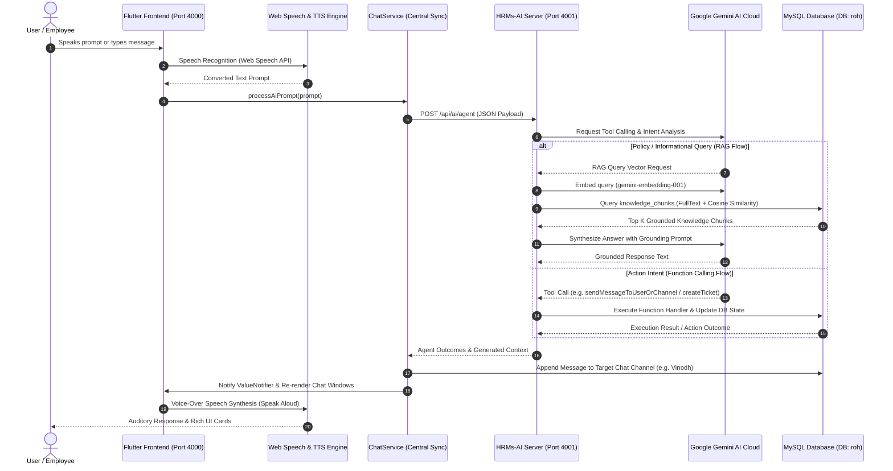

# Overall System Architecture Blueprint: HRMs-ERP & HRMs-AI Engine

**Project**: HRMs-ERP (Keka Clone) & HRMs-AI Autonomous Action Engine  
**Version**: 2.0.0 (Production Architecture)  
**Last Updated**: August 2026  

---

## 1. System Architecture Chart

```mermaid
flowchart TD
    %% User Inputs & Interaction Layer
    subgraph UI_Layer ["Flutter Web / Mobile Client (Port 4000)"]
        User([User Prompt / Speech]) --> InputBar["Chat Input / Mic Recognition Button"]
        InputBar --> VoiceEng["Web Speech API (Speech-To-Text)"]
        VoiceEng --> Prompts["Processed Natural Language Prompt"]
        
        Prompts --> UI_Touchpoints["UI Touchpoints"]
        UI_Touchpoints --> DashFloat["Floating Dashboard Chatbot"]
        UI_Touchpoints --> AIDrawer["Slide-Out AI Chat Drawer"]
        UI_Touchpoints --> TeamChat["Teams Chat (Gemini AI Channel)"]
        
        UI_Touchpoints --> ChatService["Centralized ChatService & ValueNotifier"]
        ChatService --> UI_Sync["Live Multi-Window Chat Synchronization"]
        
        TTSEngine["Web SpeechSynthesis Voice-Over (TTS)"] <-- "Reads Responses Aloud" --- UI_Touchpoints
    end

    %% Communication Bridge
    ChatService -->|HTTP REST API / JSON| API_Gateway["HRMs-AI Service API (Port 4001)"]

    %% Backend Server Layer
    subgraph Backend_Layer ["HRMs-AI Express Backend (Node.js Engine - Port 4001)"]
        API_Gateway --> IntentClassifier{"Intent Router"}
        
        IntentClassifier -->|Policy / Info Query| RAG_Engine["RAG Retrieval Engine (ragService.js)"]
        IntentClassifier -->|Action / Task Command| Agent_Engine["Autonomous Action Agent (agentService.js)"]

        subgraph RAG_System ["RAG Retrieval & Hybrid Search"]
            RAG_Engine --> Embedder["Gemini Embedder (gemini-embedding-001)"]
            Embedder --> HybridSearch["Hybrid Search: MySQL FullText (BM25) + Cosine Vector Similarity"]
            HybridSearch --> GroundingContext["Context Builder & Prompt Synthesizer"]
            GroundingContext --> RAG_LLM["Gemini Generative Model (gemini-3.6-flash)"]
        end

        subgraph Agent_System ["Autonomous Action Agent & Tool Calling"]
            Agent_Engine --> ToolRegistry["Function Tool Registry (toolRegistry.js)"]
            ToolRegistry --> FunctionDeclarations["Tool Declarations: createTicket, assignTicket, applyLeave, sendMessageToUserOrChannel, etc."]
            FunctionDeclarations --> RiskEvaluator{"HITL Risk Classification"}
            
            RiskEvaluator -->|LOW / MEDIUM Risk| AutoExec["Execute DB Function / Dispatch Message"]
            RiskEvaluator -->|HIGH Risk| HITL_Queue["Store in agent_pending_actions (Human-In-The-Loop Card)"]
        end
    end

    %% Database & External AI Services
    subgraph DB_Layer ["MySQL Database (DB: roh @ 127.0.0.1:3306)"]
        HybridSearch <--> KnowledgeTable[("knowledge_chunks\n(content, FT Index, 3072-dim JSON Embeddings)")]
        AutoExec <--> CoreTables[("tickets, leaves, attendance, employees, chat_messages")]
        HITL_Queue <--> PendingTable[("agent_pending_actions")]
        AutoExec --> LogTable[("agent_action_log")]
    end

    subgraph AI_Cloud ["Google Gemini AI Cloud API"]
        Embedder <-->|REST API| GeminiEmbedAPI["gemini-embedding-001 API"]
        RAG_LLM <-->|REST API| GeminiGenAPI["gemini-3.6-flash API"]
        ToolRegistry <-->|Function Calling| GeminiGenAPI
    end

    %% DevOps Pipeline
    subgraph DevOps ["Automated DevOps & Sync"]
        CronTask["System Crontab / AGY Scheduler (Daily 5:00 PM)"] --> PushScript["auto_push.sh"]
        PushScript --> GitHub[("GitHub Repository: vinodh1299/HRMs-ERP")]
    end
```

---

## 2. Interactive AI & Data Flow Sequence



---

## 3. Core Architectural Subsystems

### 3.1 Frontend Subsystem (KEKA CLONE - Flutter Web & Mobile)
- **Port**: `4000`
- **Architecture**: Clean Layered Architecture (UI Widgets $\rightarrow$ Riverpod Providers $\rightarrow$ Services $\rightarrow$ API Layer).
- **Core AI Entrypoints**:
  1. **Floating Dashboard Assistant**: Quick floating chat popup on the home dashboard with voice mic controls.
  2. **Slide-Out AI Chat Drawer (`AiChatDrawer`)**: Dedicated right-hand drawer supporting Action Agent HITL confirmation cards and RAG Policy search.
  3. **Teams Chat (`ChatScreen`)**: Multi-channel messaging UI with a dedicated `Gemini AI Assistant` channel.
- **Central Synchronization (`ChatService`)**: Uses a `ValueNotifier` event bus to synchronize messages across floating chat widgets and chat screens in real-time.
- **Voice-Over Engine (`VoiceHelper`)**: Integrated Web Speech Synthesis for reading AI answers aloud, paired with a `Listen` speaker button on every AI message card.

---

### 3.2 Backend Subsystem (HRMs-AI Engine - Node.js Express)
- **Port**: `4001`
- **AI Models**:
  - `gemini-3.6-flash`: High-speed generative model for function calling, intent classification, and RAG synthesis.
  - `gemini-embedding-001`: 3072-dimensional vector embedding model for document chunk indexing and semantic search.
- **RAG Retrieval Engine (`ragService.js`)**: Combines MySQL `FULLTEXT` BM25 keyword matching with cosine similarity over JSON vector embeddings stored in `knowledge_chunks`.
- **Autonomous Action Agent (`agentService.js` & `toolRegistry.js`)**: Executes application functions via Gemini Function Calling.

---

### 3.3 Database & Knowledge Schema (MySQL `roh`)
- **Host**: `127.0.0.1:3306`

#### 1. `knowledge_chunks` (RAG Knowledge Base)
```sql
CREATE TABLE IF NOT EXISTS knowledge_chunks (
    id INT AUTO_INCREMENT PRIMARY KEY,
    document_id VARCHAR(100) NOT NULL,
    chunk_index INT NOT NULL,
    content TEXT NOT NULL,
    metadata JSON,
    embedding JSON,
    created_at DATETIME DEFAULT CURRENT_TIMESTAMP,
    FULLTEXT KEY ft_content (content)
);
```

#### 2. `agent_action_log` (Audit Trail)
```sql
CREATE TABLE IF NOT EXISTS agent_action_log (
    id INT AUTO_INCREMENT PRIMARY KEY,
    user_id INT,
    action_type VARCHAR(100) NOT NULL,
    details JSON,
    risk_level ENUM('LOW', 'MEDIUM', 'HIGH') NOT NULL,
    status ENUM('EXECUTED', 'PENDING', 'CONFIRMED', 'DECLINED', 'FAILED') NOT NULL,
    created_at DATETIME DEFAULT CURRENT_TIMESTAMP
);
```

#### 3. `agent_pending_actions` (Human-In-The-Loop Queue)
```sql
CREATE TABLE IF NOT EXISTS agent_pending_actions (
    id INT AUTO_INCREMENT PRIMARY KEY,
    user_id INT NOT NULL,
    action_name VARCHAR(100) NOT NULL,
    arguments JSON NOT NULL,
    description TEXT NOT NULL,
    status ENUM('PENDING', 'CONFIRMED', 'DECLINED') DEFAULT 'PENDING',
    created_at DATETIME DEFAULT CURRENT_TIMESTAMP
);
```

---

## 4. Human-In-The-Loop (HITL) Safety & Risk Matrix

To ensure enterprise security, all agent actions are classified into three risk tiers:

| Risk Tier | Tools | Execution Behavior | UI Presentation |
| :--- | :--- | :--- | :--- |
| **LOW** | `queryTeamAttendance` | Auto-executes immediately | Inline Result Card |
| **MEDIUM** | `createTicket`, `applyLeave`, `sendInternalNote`, `sendMessageToUserOrChannel` | Auto-executes with undo/toast notification | Success Toast + Reversal Option |
| **HIGH** | `assignTicket`, `updateTicketStatus` | Staged in `agent_pending_actions` until user approves | Interactive Confirmation Card with `CONFIRM` / `DECLINE` buttons |

---

## 5. Automated DevOps & Deployment Pipeline

- **Script**: [`auto_push.sh`](file:///Users/acamedia/VINODH/KEKA%20CLONE/auto_push.sh)
- **Schedule**: Everyday at 5:00 PM via system `crontab` (`0 17 * * *`) & Antigravity `schedule` daemon.
- **Repository**: [`https://github.com/vinodh1299/HRMs-ERP.git`](https://github.com/vinodh1299/HRMs-ERP.git)
- **Target Branch**: `main`
