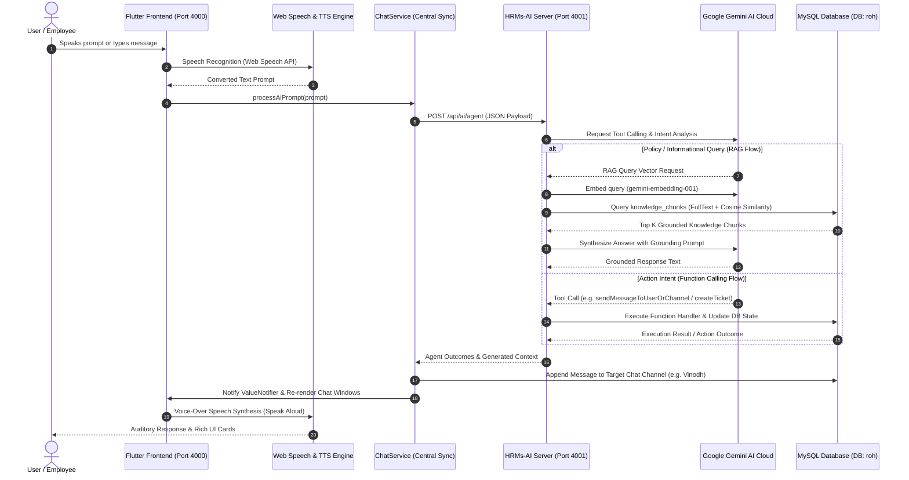

# Comprehensive System Architecture & Technical Blueprint

**Project**: HRMs-ERP (Keka Clone) & HRMs-AI Autonomous Action Engine  
**Version**: 2.5.0 (Production Architecture & Advanced Technology Roadmap)  
**Last Updated**: August 2026  

---

## 1. Executive Summary

This blueprint details the technical specification, system architecture, completed implementations, and future technology roadmap for the **HRMs-ERP Application** paired with the **HRMs-AI Engine**.

The system merges a modern, multi-platform Flutter Web/Mobile ERP frontend with a dedicated Node.js/Express AI microservice powered by Google Gemini generative and embedding models. The architecture provides:
1. **Retrieval-Augmented Generation (RAG) Policy Chatbot**: Answers employee questions grounded strictly in indexed company policies, department SOPs, and ticket records.
2. **Prompt-Driven Autonomous AI Action Agent**: Executes application functions (raising support tickets, applying for leave, querying team presence, and sending direct messages across team chat channels) using natural language prompts and Speech-To-Text voice inputs.
3. **Voice-Over Text-To-Speech (TTS) Engine**: Reads AI responses out loud automatically with clean vocalization and interactive speaker buttons.

---

## 2. High-Level System Architecture Chart

```mermaid
flowchart TD
    %% User Inputs & Interaction Layer
    subgraph UI_Layer ["Flutter Web / Mobile Client (Port 4000)"]
        User([User Prompt / Speech Input]) --> InputBar["Chat Input / Mic Recognition Button"]
        InputBar --> VoiceEng["Web Speech API (Speech-To-Text)"]
        VoiceEng --> Prompts["Processed Natural Language Prompt"]
        
        Prompts --> UI_Touchpoints["UI Touchpoints"]
        UI_Touchpoints --> DashFloat["Floating Dashboard Chatbot"]
        UI_Touchpoints --> AIDrawer["Slide-Out AI Chat Drawer"]
        UI_Touchpoints --> TeamChat["Teams Chat (Gemini AI Channel)"]
        
        UI_Touchpoints --> ChatService["Centralized ChatService & ValueNotifier"]
        ChatService --> UI_Sync["Live Multi-Window Chat Synchronization"]
        
        TTSEngine["Web SpeechSynthesis Voice-Over (TTS)"] <-- "Reads Responses Aloud" --- UI_Touchpoints
    end

    %% Communication Bridge
    ChatService -->|HTTP REST API / JSON| API_Gateway["HRMs-AI Service API (Port 4001)"]

    %% Backend Server Layer
    subgraph Backend_Layer ["HRMs-AI Express Backend (Node.js Engine - Port 4001)"]
        API_Gateway --> IntentClassifier{"Intent Router"}
        
        IntentClassifier -->|Policy / Info Query| RAG_Engine["RAG Retrieval Engine (ragService.js)"]
        IntentClassifier -->|Action / Task Command| Agent_Engine["Autonomous Action Agent (agentService.js)"]

        subgraph RAG_System ["RAG Retrieval & Hybrid Search"]
            RAG_Engine --> Embedder["Gemini Embedder (gemini-embedding-001)"]
            Embedder --> HybridSearch["Hybrid Search: MySQL FullText (BM25) + Cosine Vector Similarity"]
            HybridSearch --> GroundingContext["Context Builder & Prompt Synthesizer"]
            GroundingContext --> RAG_LLM["Gemini Generative Model (gemini-3.6-flash)"]
        end

        subgraph Agent_System ["Autonomous Action Agent & Tool Calling"]
            Agent_Engine --> ToolRegistry["Function Tool Registry (toolRegistry.js)"]
            ToolRegistry --> FunctionDeclarations["Tool Declarations: createTicket, assignTicket, applyLeave, sendMessageToUserOrChannel, queryTeamAttendance"]
            FunctionDeclarations --> RiskEvaluator{"HITL Risk Classification"}
            
            RiskEvaluator -->|LOW / MEDIUM Risk| AutoExec["Execute DB Function / Dispatch Message"]
            RiskEvaluator -->|HIGH Risk| HITL_Queue["Store in agent_pending_actions (Human-In-The-Loop Card)"]
        end
    end

    %% Database & External AI Services
    subgraph DB_Layer ["MySQL Database (DB: roh @ 127.0.0.1:3306)"]
        HybridSearch <--> KnowledgeTable[("knowledge_chunks\n(content, FT Index, 3072-dim JSON Embeddings)")]
        AutoExec <--> CoreTables[("tickets, leaves, attendance, employees, chat_messages")]
        HITL_Queue <--> PendingTable[("agent_pending_actions")]
        AutoExec --> LogTable[("agent_action_log")]
    end

    subgraph AI_Cloud ["Google Gemini AI Cloud API"]
        Embedder <-->|REST API| GeminiEmbedAPI["gemini-embedding-001 API"]
        RAG_LLM <-->|REST API| GeminiGenAPI["gemini-3.6-flash API"]
        ToolRegistry <-->|Function Calling| GeminiGenAPI
    end
```

---

## 3. Interactive Data Flow Sequence



---

## 4. Completed Work & Core Features Implemented

### 4.1 Frontend Infrastructure (Flutter Web & Mobile)
- **Unified Navigation & Layout**: Responsive navigation bar with sidebar drawer, top header bar, and department grid portals (IT, HR, Maintenance, Finance, CPD, Inventory, HOB, Media).
- **Core ERP Modules**:
  - **Me Tab**: Attendance logs, check-in/clock-out, leave regularization, and leave balances (Casual, Sick, Earned).
  - **Home Dashboard**: Quick clock-in/out banner, live department staff presence directory, announcements, and polls.
  - **Helpdesk & Department Portals**: Service ticket submission, priority tracking, category filtering, and status workflows.
  - **My Teams Chat (`ChatScreen`)**: Direct messaging and team channels (`#general`, `#maintenance-updates`, `#finance-reimbursements`, `Gemini AI Assistant`).
- **Centralized Chat & Multi-Window Synchronization (`ChatService`)**:
  - Centralized conversation state store with a reactive `ValueNotifier` event bus.
  - Prompts entered in the floating dashboard assistant or slide-out AI drawer automatically update team chat channels in real time.
- **Voice-Over Text-To-Speech (TTS) & Mic Recognition**:
  - Hands-free Speech-To-Text input (`Icons.mic`) using the Web Speech API.
  - Automatic SpeechSynthesis Voice-Over on AI responses with clean vocalization (markdown symbols and emojis stripped for speech output).
  - Interactive **`Listen`** speaker buttons on all AI response cards for manual replay.

### 4.2 Backend & RAG Database Infrastructure (HRMs-AI Engine)
- **Node.js/Express Server**: Running on port `4001` with modular config (`db.js`, `gemini.js`) and endpoints (`/api/ai/chat`, `/api/ai/agent`, `/api/ai/agent/confirm`, `/api/ai/agent/decline`).
- **MySQL Integration (Database `roh` @ `127.0.0.1:3306`)**:
  - Initialized schema for `knowledge_chunks`, `agent_action_log`, `agent_pending_actions`, `tickets`, `leaves`, `attendance`, `employees`, and `chat_messages`.
- **Hybrid RAG Retrieval Engine (`ragService.js`)**:
  - Combines MySQL `FULLTEXT` index (`ft_content`) BM25 keyword recall with cosine similarity over 3072-dimensional JSON vector embeddings (`gemini-embedding-001`).
- **Function Calling Action Agent (`agentService.js` & `toolRegistry.js`)**:
  - Type-safe function tools: `createTicket`, `assignTicket`, `applyLeave`, `updateTicketStatus`, `sendInternalNote`, `sendMessageToUserOrChannel`, `queryTeamAttendance`.
  - Human-In-The-Loop (HITL) risk classification (`LOW`, `MEDIUM`, `HIGH`) with pending action queues and interactive UI approval cards.

---

## 5. Detailed Technical Architecture Explanation

### 5.1 Clean Layered Frontend Architecture
The Flutter frontend follows a clean 4-tier separation:
1. **Presentation Layer (UI Widgets & Screens)**: Screen components (`DashboardScreen`, `ChatScreen`, `MeDashboard`, `HelpdeskScreen`) render reactive UI widgets and listen to state changes.
2. **State Management Layer (Riverpod & ValueNotifier)**: `ChatService.messageNotifier` handles real-time cross-screen message sync, while Riverpod manages authentication, attendance, and leave states.
3. **Service Layer (`HrmsAiApiService`, `VoiceHelper`, `ChatService`)**: Encapsulates external HTTP requests, speech recognition, speech synthesis, and prompt parsing.
4. **Core Core / Utility Layer**: Theme constants, responsive break-points (`Responsive`), and custom date/time parsers (`DateParserHelper`).

### 5.2 RAG Hybrid Retrieval & Grounding Mechanism
1. **Indexing Phase**: Policy documents are split into semantic chunks, embedded via `gemini-embedding-001` (3072 dimensions), and stored in MySQL `knowledge_chunks` along with metadata and full-text indexes.
2. **Query Phase**: When a user asks a policy question, the query string is embedded and searched against `knowledge_chunks` using a hybrid score formula:
   $$\text{Score} = (\alpha \times \text{FullTextMatch}) + (\beta \times \text{CosineSimilarity})$$
3. **Synthesis Phase**: The top-ranked context chunks are combined with a strict system prompt instructing Gemini `gemini-3.6-flash` to answer using only the provided context, eliminating hallucinations.

### 5.3 Function Calling Action Agent & HITL Safety Matrix
The Action Agent converts natural language prompts into application mutations:
- **Risk Tiers**:
  - **LOW Risk**: `queryTeamAttendance` $\rightarrow$ Executes automatically and returns inline results.
  - **MEDIUM Risk**: `createTicket`, `applyLeave`, `sendInternalNote`, `sendMessageToUserOrChannel` $\rightarrow$ Executes automatically and notifies the user with undo capability.
  - **HIGH Risk**: `assignTicket`, `updateTicketStatus` $\rightarrow$ Staged in `agent_pending_actions` table and renders an interactive **`CONFIRM` / `DECLINE`** card in the AI Drawer for human approval before touching the database.

---

## 6. Advanced Future Technologies Roadmap

The following advanced technologies can be implemented to take the HRMs-ERP & AI Engine to the next level:

### 6.1 Multi-Modal Vision & Document Processing
- **Invoice & Receipt OCR Analysis**: Integrate Gemini Vision to automatically process uploaded employee expense receipts, medical bills, and travel invoices, extracting line items, totals, and vendor details into reimbursement tickets.
- **ID Photo & Document Verification**: Automatically audit uploaded employee ID proofs and certificates during onboarding.

### 6.2 Autonomous Multi-Agent Swarm Architecture
- **Specialized Subagent Nodes**: Transition from a single agent router to an autonomous multi-agent swarm:
  - **Payroll & Tax Agent**: Handles salary query breakdowns, tax projections, and payslip generation.
  - **Attendance & Shift Audit Agent**: Scans daily clock-in anomalies and proactively suggests regularization workflows.
  - **IT Diagnostic Agent**: Automated troubleshooting scripts for software, VPN, and network issues.
- **Inter-Agent Communication**: Use an event bus (Redis Pub/Sub or RabbitMQ) for asynchronous agent-to-agent collaboration.

### 6.3 GraphRAG & Knowledge Graph Integration (Neo4j / Memgraph)
- **Hierarchical & Dependency Graph Search**: Complement vector search with a Knowledge Graph mapping employee reporting structures, project teams, department asset dependencies, and cross-department workflows.
- **Multi-Hop Reasoning**: Enables complex queries like *"Who is the escalation manager for IT hardware issues in the Media department when Liam Neeson is on leave?"*.

### 6.4 Streaming Real-Time SSE & WebSockets Protocol
- **Server-Sent Events (SSE)**: Stream AI responses token-by-token for immediate visual typing effects in the chat window.
- **WebSocket Gateway**: Push instant notifications to team members when an AI action dispatches a message or assigns a ticket.

### 6.5 Fine-Tuned Domain Models & Low-Rank Adaptation (LoRA)
- **Domain Fine-Tuning**: Fine-tune lightweight open LLMs (e.g. Gemma 2B / Llama 3) on enterprise HR datasets using LoRA to guarantee 100% adherence to organizational tone, terminology, and legal compliance.

### 6.6 Dedicated Vector Database Migration (Qdrant / pgvector)
- **HNSW Indexing**: Migrate vector embeddings from MySQL JSON arrays to dedicated vector engines like Qdrant or `pgvector` with HNSW (Hierarchical Navigable Small World) indexing for sub-millisecond retrieval scale across millions of chunks.

### 6.7 Zero-Latency On-Device SLMs & Edge Speech AI
- **WebAssembly Whisper & On-Device Voice AI**: Embed quantized Whisper models via WebAssembly directly in the browser client for instant, offline voice-to-text without relying on cloud API latencies.
