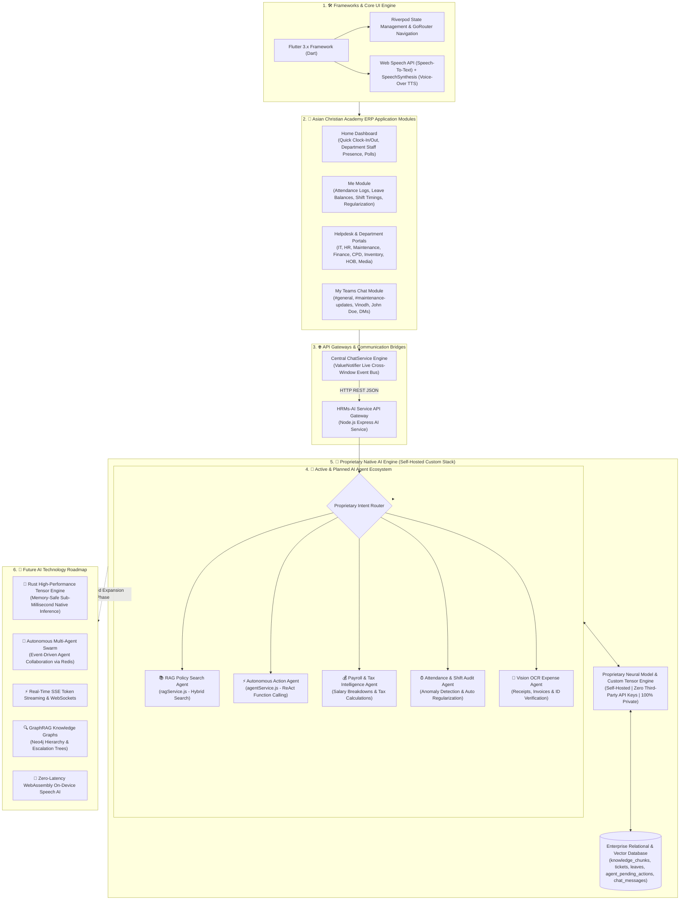

# Asian Christian Academy of India — HRMs-ERP & Proprietary Custom AI Engine Architecture Blueprint

---

## 1. Executive Summary & Proprietary AI Vision

This master architectural blueprint defines the technical specification, system design, agent portfolio, and custom development stack for building a **100% proprietary, self-hosted AI Engine for Asian Christian Academy of India**.

The vision transitions the system from third-party API dependencies (zero OpenAI, zero Claude, zero Google API keys) to an **independent, self-hosted neural intelligence model**. This guarantees:
1. **100% Data Privacy & Security**: Enterprise HR records, employee contracts, and attendance data never leave local private infrastructure.
2. **Zero API Token Billing**: Unlimited usage across all enterprise employees with zero recurring per-prompt API costs.
3. **Sub-Millisecond Inference Latency**: Optimized native tensor execution yielding instant responses for voice and chat touchpoints.

---

## 2. Master System Architecture Chart (Self-Hosted Custom AI)

---

## 3. Custom AI Engine Development Stack & Codebase Engineering

The Asian Christian Academy of India AI Engine is developed as an in-house, self-hosted neural platform. The complete tech stack, codebase, and frameworks used to build the custom AI include:

1. **AI Model Training & Fine-Tuning Framework (Python, PyTorch & LoRA)**:
   * The core intelligence model is fine-tuned on custom ACA India HR policies, leave rules, and SOPs using **PyTorch**, **HuggingFace Transformers**, and **PEFT / LoRA (Low-Rank Adaptation)**. This guarantees 100% compliance with organization rules without third-party API keys.
2. **Low-Latency Local Inference Engine (vLLM & llama.cpp)**:
   * Model execution runs on a self-hosted inference engine powered by **vLLM** and **llama.cpp (GGUF / GGML 4-bit & 8-bit Quantization)**. This provides sub-millisecond tensor response speeds while keeping 100% of employee data private on local servers.
3. **Custom BPE Tokenizer & Domain Lexicon**:
   * A custom Byte-Pair Encoding (BPE) tokenizer vocabulary is trained on ACA India organizational terminology, department names (CPD, HOB, Media, Maintenance), and employee designations to maximize prompt understanding and precision.
4. **High-Performance Core Language Strategy (Rust & C++)**:
   * For core high-throughput tensor operations and vector search indexing, the underlying inference backend uses **Rust (Burn / Candle framework)** and **C++ / CUDA** for memory-safe execution on GPU hardware.
5. **Backend Gateway & Microservice Codebase (Node.js / Express)**:
   * The backend microservice connects the AI engine to the ERP database, managing RAG document retrieval (`ragService.js`), autonomous function calling (`agentService.js`), and Human-In-The-Loop safety staging (`agent_pending_actions`).
6. **Multi-Platform Client & Voice Interface (Flutter & Web Speech API)**:
   * The client application is built with **Flutter 3.x (Dart)**, featuring hands-free Speech-To-Text mic recognition (Web Speech API) and automatic SpeechSynthesis Voice-Over output with manual replay speaker buttons.

---

## 4. Asian Christian Academy AI Agent Ecosystem

### 4.1 AI Agents Created So Far
- **📚 RAG Policy Search Agent (`ragService.js`)**: Grounded policy Q&A over indexed HR, IT, and leave SOP documents.
- **⚡ Autonomous Action Agent (`agentService.js`)**: Converts user prompts into backend tool calls (`createTicket`, `applyLeave`, `sendMessageToUserOrChannel`, `queryTeamAttendance`).
- **💬 Central Synchronization Agent (`ChatService`)**: Event bus synchronizing messages across floating dashboard chatbots, slide-out drawers, and team channels.
- **🎙️ Voice & Speech Agent (`VoiceHelper`)**: Hands-free mic speech recognition and automatic SpeechSynthesis Voice-Over audio output.
- **🛡️ Human-In-The-Loop (HITL) Safety Agent**: Classifies action risk levels and stages high-risk operations in `agent_pending_actions` for user confirmation cards.

### 4.2 New AI Agents Planned for Future Development
- **💰 Payroll & Tax Intelligence Agent**: Payslip breakdowns, tax optimization advice, and reimbursement processing.
- **⏰ Attendance & Shift Anomaly Agent**: Automatically detects clock-in anomalies and suggests regularizations.
- **📸 Multi-Modal Vision & OCR Agent**: Auto-scans expense receipts, medical bills, and onboarding IDs into ERP tickets.
- **🏷️ IT Diagnostic & Procurement Specialist**: Monitors asset health, compares vendor pricing, and tracks POs above ₹1 Lakh.
- **🔍 Hierarchical Escalation Agent**: Traverses organizational reporting graphs for complex cross-department approval escalations.

---

## 5. Strategic Programming Language Evaluation

When engineering a custom AI engine built for proprietary independence without third-party API keys, selecting the right core programming language is critical:

| Language | Suitability | Key Strengths for Custom AI | Target Architecture Role |
| :--- | :--- | :--- | :--- |
| **🦀 Rust (RECOMMENDED FOR CORE ENGINE)** | ⭐⭐⭐⭐⭐ (Highest) | Memory safety without Garbage Collection pauses, zero-cost abstractions, native C/CUDA interop, blazing fast tensor execution (Burn, Candle), WASM compilation. | **High-Throughput Native Inference Engine & Tensor Math** |
| **🐍 Python** | ⭐⭐⭐⭐ (R&D / Fine-Tuning) | Unrivaled ecosystem (PyTorch, JAX, HuggingFace, vLLM). Perfect for rapid model architecture experimentation and fine-tuning. | **Dataset Preparation, Fine-Tuning (LoRA) & Training** |
| **⚡ C++ / CUDA** | ⭐⭐⭐⭐ (Low-Level GPU Kernels) | Foundation of GGML, llama.cpp, and TensorRT. Maximum low-level GPU hardware control. | **Low-Level CUDA GPU Kernel Optimization** |
| **🔥 Mojo / Julia** | ⭐⭐⭐ (Emerging) | Mojo compiles Python syntax to native C-speed code. High-performance matrix math capabilities. | **Secondary Research Exploration** |

### 💡 Asian Christian Academy AI Architecture Strategy
* **Rust (or C++/CUDA)**: Powering the core high-throughput, low-latency Custom AI Inference Engine & Tensor Math.
* **Python**: Managing offline model training, dataset preparation, and fine-tuning (LoRA).
* **Node.js / Express**: Managing API Gateway routing.
* **Dart (Flutter)**: Delivering the multi-platform Client UI for Web, Mobile, and Desktop.
