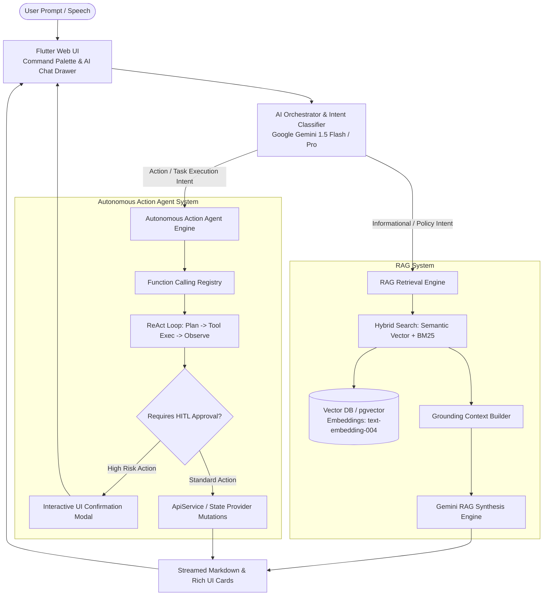
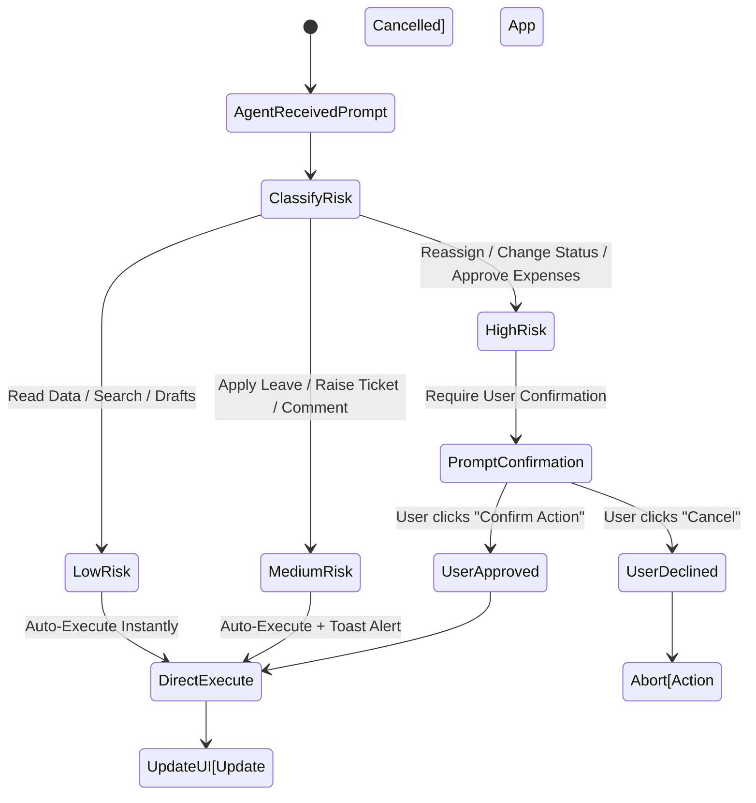

# Architecture Specification: RAG AI Chatbot & Autonomous AI Action Agent
**System Design Blueprint for HRMs-ERP (Keka Clone)**

---

## 1. Executive Summary & Product Vision

This document details the architectural blueprint and technical specification for embedding an advanced, enterprise-grade AI system into the **HRMs-ERP Application**. The AI integration consists of two core engines operating in unison:

1. **Retrieval-Augmented Generation (RAG) AI Chatbot**: An intelligent knowledge retrieval assistant that grounds LLM responses in real-time company policies, leave rules, IT/Media SOPs, ticket histories, and organizational data.
2. **Autonomous Prompt-Driven AI Action Agent**: An interactive, tool-calling agent capable of executing **any action inside the application strictly via natural language prompts** (e.g., *"Raise a hardware ticket for my laptop display"*, *"Assign ticket #1007 to Liam Neeson"*, *"Apply for 2 days sick leave next week"*, or *"Show me Maintenance department attendance for today"*).

---

## 2. High-Level System Architecture



---

## 3. RAG AI Chatbot Architecture

### 3.1 Data Sources & Vector Ingestion Pipeline
The RAG system indexes structured and unstructured data across the organization while enforcing strict **Role-Based Access Control (RBAC)**.

| Data Category | Sources | Update Frequency | Embedding Model |
| :--- | :--- | :--- | :--- |
| **HR Policies & Handbooks** | Leave policy, Benefits, Reimbursements, Code of Conduct | On Document Update | `text-embedding-004` (768-dim) |
| **Department SOPs** | Media AV guidelines, IT troubleshooting, Maintenance guides | Weekly / On Edit | `text-embedding-004` |
| **Ticket Knowledge Base** | Resolved tickets, public discussions, solutions | Real-time Sync | `text-embedding-004` |
| **Org & Employee Data** | Department structures, designations, roles | Real-time Sync | Hybrid Metadata Filtering |

### 3.2 Chunking & Metadata Strategy
```json
{
  "document_id": "hr_leave_policy_2026_v2",
  "chunk_id": "chunk_042",
  "content": "Employees are entitled to 12 casual leaves and 12 sick leaves annually. Unused casual leave lapses at year-end.",
  "metadata": {
    "department": "HR",
    "access_level": ["Employee", "Manager", "Admin"],
    "category": "Leave Policy",
    "updated_at": "2026-07-01T00:00:00Z"
  }
}
```

### 3.3 Hybrid Search & Security Grounding
1. **Semantic Search**: Vector similarity search using cosine distance on PostgreSQL `pgvector` or Firebase SQL Data Connect.
2. **Metadata Filtering**: Pre-filter query results according to `user.role` and `employee.departmentName`. Staff cannot retrieve internal manager-only notes or restricted financial records.
3. **Re-Ranking & Prompt Synthesis**: The top 5 context chunks are passed to Gemini with a strict system instruction:
   > *"Answer the user query strictly using the provided Context. If the context does not contain the answer, state that the information is unavailable in company documentation."*

---

## 4. Autonomous AI Action Agent (Prompt-Driven Execution)

The AI Action Agent transforms natural language instructions into precise API mutations and state updates across the HRMs-ERP application using **Function Calling**.

### 4.1 Function Tool Calling Registry
The agent is equipped with type-safe function schemas mapped directly to `ApiService` methods:

```dart
// Function Registry Schema Definitions
final List<FunctionDeclaration> agentTools = [
  // 1. Create Ticket
  FunctionDeclaration(
    'createTicket',
    'Raises a new service or support ticket for a specific department.',
    Schema.object(properties: {
      'subject': Schema.string(description: 'Summary title of the issue'),
      'category': Schema.string(description: 'Target department, e.g., Media, Maintenance, IT, HR'),
      'subCategory': Schema.string(description: 'Specific subcategory, e.g., Hardware, Software, AV Equipment'),
      'description': Schema.string(description: 'Detailed description of the issue'),
      'priority': Schema.string(description: 'Priority level: LOW, MEDIUM, HIGH, URGENT', enumValues: ['LOW', 'MEDIUM', 'HIGH', 'URGENT']),
    }, requiredProperties: ['subject', 'category', 'description']),
  ),

  // 2. Assign Ticket
  FunctionDeclaration(
    'assignTicket',
    'Assigns an open ticket to a department employee.',
    Schema.object(properties: {
      'ticketId': Schema.integer(description: 'The unique numeric ID of the ticket'),
      'employeeNameOrId': Schema.string(description: 'Full name or employee ID of the assigned staff member'),
    }, requiredProperties: ['ticketId', 'employeeNameOrId']),
  ),

  // 3. Apply for Leave
  FunctionDeclaration(
    'applyLeave',
    'Submits a leave request for the authenticated employee.',
    Schema.object(properties: {
      'leaveType': Schema.string(description: 'Type of leave: Sick Leave, Casual Leave, Earned Leave', enumValues: ['Sick Leave', 'Casual Leave', 'Earned Leave']),
      'startDate': Schema.string(description: 'Start date in YYYY-MM-DD format'),
      'endDate': Schema.string(description: 'End date in YYYY-MM-DD format'),
      'reason': Schema.string(description: 'Reason for leave request'),
    }, requiredProperties: ['leaveType', 'startDate', 'endDate', 'reason']),
  ),

  // 4. Update Ticket Status
  FunctionDeclaration(
    'updateTicketStatus',
    'Updates ticket state (In Progress, On Hold, Closed).',
    Schema.object(properties: {
      'ticketId': Schema.integer(description: 'The ticket ID to update'),
      'status': Schema.string(description: 'New status', enumValues: ['In Progress', 'On Hold', 'Closed']),
    }, requiredProperties: ['ticketId', 'status']),
  ),

  // 5. Send Internal Chat Message
  FunctionDeclaration(
    'sendInternalNote',
    'Sends an internal private chat note or approval request on a ticket.',
    Schema.object(properties: {
      'ticketId': Schema.integer(description: 'Target ticket ID'),
      'note': Schema.string(description: 'Private note content'),
      'isApprovalRequest': Schema.boolean(description: 'Whether this requires manager approval'),
    }, requiredProperties: ['ticketId', 'note']),
  ),

  // 6. Query Attendance & Team Status
  FunctionDeclaration(
    'queryTeamAttendance',
    'Fetches team attendance, present count, or employees on leave for a specified date.',
    Schema.object(properties: {
      'date': Schema.string(description: 'Target date YYYY-MM-DD or relative keywords like "today", "yesterday"'),
      'department': Schema.string(description: 'Filter by department name'),
    }),
  ),
];
```

### 4.2 Action Execution Loop (ReAct Framework)

```
User Prompt: "Assign ticket #1012 to Liam Neeson and post an internal note saying parts are ordered."

Step 1: Intent Analysis & Tool Selection
        -> Selected Tools: [assignTicket, sendInternalNote]

Step 2: Tool Argument Resolution
        -> Tool 1: assignTicket(ticketId: 1012, employeeNameOrId: "Liam Neeson")
        -> Tool 2: sendInternalNote(ticketId: 1012, note: "Parts are ordered.", isApprovalRequest: false)

Step 3: Execution & Verification
        -> Executing ApiService.assignTicket(1012, employeeId: 2) -> SUCCESS
        -> Executing ApiService.sendInternalMessage(1012, content: "Parts are ordered.") -> SUCCESS

Step 4: Response Synthesis
        -> UI Notification: "Ticket #1012 successfully assigned to Liam Neeson, and internal note posted."
```

---

## 5. Safety, Human-in-the-Loop (HITL) & Guardrails

To prevent unwanted or high-impact actions from executing autonomously, the agent enforces a strict tier system:



* **Low Risk**: Querying attendance, reading company policy, searching directory, viewing leave balances. (Executed automatically).
* **Medium Risk**: Raising a service ticket, drafting a leave application, sending a public chat response. (Executed with undo toast option).
* **High Risk**: Assigning/reassigning tickets, closing tickets, approving leave/expenses, submitting official status updates. (Requires explicit interactive confirmation modal with preview diff).

---

## 6. Frontend Integration & User Interface

### 6.1 Unified AI Assistant Launcher (`Ctrl + K` or Floating Button)
A floating action launcher available globally across all screens in the Flutter Web application:

* **Command Bar Overlay**: Quick natural language input field with autocomplete suggestions (*"Raise ticket for...", "Check my leaves", "Who is on leave today?"*).
* **Interactive Rich Widgets in Chat**: Rather than plain text responses, the AI Chat drawer renders dynamic native Flutter widgets inside chat messages:
  * **Ticket Summary Card**: Displays inline status badges, assignee photo, and a quick *"View Full Ticket"* button that calls `Navigator.push`.
  * **Leave Application Card**: Interactive card previewing start/end dates with an instant *"Submit Request"* button.
  * **Interactive Approval Cards**: Rendered for Managers to approve/reject requests directly inside the chat interface.

```dart
// Dynamic Widget Renderer for AI Agent Responses
Widget buildAgentMessageWidget(AgentMessage msg) {
  if (msg.hasActionCard) {
    switch (msg.actionType) {
      case 'TICKET_CREATED':
        return TicketSummaryActionCard(ticketData: msg.payload);
      case 'LEAVE_DRAFT':
        return LeaveDraftCard(leaveData: msg.payload, onSubmit: () => executeConfirmedAction(msg.actionId));
      default:
        return MarkdownBody(data: msg.text);
    }
  }
  return MarkdownBody(data: msg.text);
}
```

---

## 7. Implementation Roadmap & Milestones

### Phase 1: Knowledge Base Preparation & Vector Pipeline
- Build vector embeddings for Employee Handbooks, Department SOPs, and Ticket Knowledge base using Gemini `text-embedding-004`.
- Setup metadata-based role filtering to guarantee data privacy.

### Phase 2: Function Calling Tool Registry
- Register all `ApiService` methods into Gemini function calling schema.
- Implement the ReAct loop handler in `lib/services/ai_agent_service.dart`.

### Phase 3: HITL Guardrails & Execution Layer
- Build confirmation dialogs for high-impact actions (ticket assignments, status changes, leave submissions).
- Implement execution handlers to update Riverpod state providers dynamically.

### Phase 4: Flutter Floating Drawer & Command Palette
- Build global `Ctrl + K` AI Launcher overlay and slide-out chat drawer.
- Implement rich card rendering for ticket summaries, leave drafts, and team presence.

---

## 8. Summary of Capabilities

| User Natural Language Prompt | AI Engine | Executed Application Action |
| :--- | :--- | :--- |
| *"What is the policy for carry-forward leaves at year end?"* | **RAG Engine** | Searches HR Leave Policy vector index and synthesizes grounded answer with section citations. |
| *"Raise an urgent ticket for Maintenance: Projector display tint issue in room 4B."* | **Action Agent** | Calls `createTicket(subject: "...", category: "Maintenance", priority: "URGENT")` and opens the newly raised ticket. |
| *"Assign ticket #1012 to Liam Neeson and add an internal note."* | **Action Agent** | Updates `assigned_to: 2`, adds internal chat note, updates involvement profile cards, and triggers notification badge. |
| *"Show me everyone on leave today in the Media department."* | **Action Agent + RAG** | Queries `queryTeamAttendance(date: "today", department: "Media")` and displays interactive team status list. |
| *"Apply for sick leave tomorrow with reason flu."* | **Action Agent** | Drafts leave application, previews dates in interactive card, and submits upon user confirmation. |

---
*Document Version: 1.0.0*  
*Target Framework: Flutter 3.x / Dart / Google Gemini API (Function Calling & Embeddings)*
